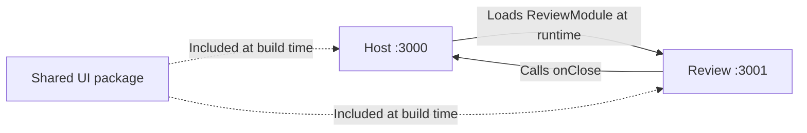

# ORDO

ORDO helps independent professionals collect purchase documents, review extracted information, and prepare an expense summary.

## Status

The local application includes a federated review module, URL navigation, and persistent document imports. The Documents screen accepts PDF, PNG, and JPEG files through selection or drag-and-drop, displays saved originals, and supports file-name search and format filters. The API extracts fields from text-based PDFs and persists them for review. Files and extraction results survive page reloads and API restarts. The review form, correction workflow, OCR, and export are the next steps.

## First release

The first release will support a batch of up to five documents:

1. Upload purchase invoices as text-based PDFs or PNG/JPEG images.
2. Follow the processing status of each document independently.
3. Review the original document beside an editable form.
4. Correct extracted supplier names, invoice references, dates, currencies, and totals.
5. Confirm reviewed documents and export their data as CSV.

Processing failures will remain isolated per document. File hashes will identify exact duplicate uploads.

## Document processing

The backend uses PDF.js for embedded PDF text and TypeScript rules for field extraction. New imports are processed before the import response returns. PDF extraction reads up to 20 pages and 100,000 characters; supported English and French labels identify supplier, reference, invoice date, currency, subtotal, tax, and total. Amounts are stored as integer cents. Ambiguous or missing values remain empty, and missing amounts are never calculated from other extracted fields. EUR, USD, and GBP are currently supported.

Images, PDFs without embedded text, and documents beyond the extraction limits require manual entry. An unreadable PDF is still saved and does not stop other files in the batch. Tesseract.js OCR is a later step; no LLM service is required.

Extracted values require human review; missing values remain empty. Arithmetic checks are review aids, not accounting or tax guarantees.

The first release targets selected invoice layouts. Scanned PDFs, arbitrary receipt layouts, and detailed line items are later extensions.

### Import and local persistence

`POST /api/documents` accepts a multipart `files` field with up to five files, 10 MB each. The API checks PDF/PNG/JPEG signatures and matching extensions before storing the selection. Signature checks identify the format; they do not guarantee a document can be parsed. `GET /api/documents` returns the collection and upload limits, `GET /api/documents/:id` returns document details, and `GET /api/documents/:id/content` serves an original file. `POST /api/documents/:id/extract` processes earlier imports whose extraction is still pending; repeating it preserves completed processing and user data.

Each document has its own directory under `apps/api/.data/documents`, containing `original` and `document.json`. Metadata includes file information, status, extracted fields, extraction outcome, revision, and review timestamp. Earlier metadata-only records are read as pending imports without replacing originals. Processing moves a document from `uploaded` to `needs_review`. `DATA_DIR` overrides the storage directory. Originals and metadata survive page reloads and API restarts and are ignored by Git.

The API depends on a `DocumentStore` interface. Its local implementation identifies exact duplicates by SHA-256, writes both files into a temporary directory, then publishes the complete directory by renaming it. Concurrent identical uploads keep the first complete document. Validation rejects an invalid selection before any writes; an unexpected storage failure may leave earlier documents in a batch imported, so retrying safely reuses them. Interrupted staging directories are ignored by the collection.

JSON storage is intended for this small local workspace. Azure deployment will require durable storage behind the same interface; the API container's filesystem is not the planned persistent store.

Metadata changes are serialized per document within one API process, check the expected revision, and replace the JSON through a flushed temporary file and rename. Windows destination locks receive a bounded retry. A stale revision cannot overwrite newer fields. This local adapter does not coordinate multiple API processes; a future shared-storage adapter must enforce the same revision check atomically.

## Architecture

This repository is a pnpm monorepo. **Applications** run independently; **packages** provide reusable code consumed by those applications.

| Directory            | Responsibility                                                                                 |
| -------------------- | ---------------------------------------------------------------------------------------------- |
| `apps/host`          | React application shell, navigation, and the document collection workflow.                     |
| `apps/review`        | Review microfrontend with its own development server and build; exposes `review/ReviewModule`. |
| `apps/api`           | Express API for health, document imports, listing, and original file access.                   |
| `packages/contracts` | Framework-independent types for review props, API query parameters, and responses.             |
| `packages/ui`        | Shared React components, button variants, styles, and locally bundled fonts.                   |
| `config`             | Common Webpack configuration and HTML template used by both frontends.                         |
| `tests`              | Shared test setup; behavior tests live beside the code they exercise.                          |

Each workspace has its own `package.json`. pnpm links `"@ordo/ui": "workspace:*"` to the local package, which is included at build time. Shared package changes require rebuilding their consumers. Dependencies, build output, and local caches are excluded from Git.

`@ordo/ui` exports buttons, badges, filter chips, icons, empty states, and a shared application shell. `Button` supports primary, secondary, and ghost variants, two sizes, native button props, and `type="button"` by default. Navigation links use the same appearance through `buttonClassName`, keeping the UI package independent of React Router.

Components use Tailwind utilities. `@ordo/ui/theme.css` provides fonts, Preflight, theme tokens, and base styles. Only the document owner imports it: the host bootstrap or Review's standalone bootstrap. Theme variables use `static` so they remain available to independently compiled utilities.

Each frontend's `src/styles.css` references the theme without emitting it and generates utilities from its own sources and `packages/ui/src`. Review nests its utility selectors under `.ordo-review`, used by the exposed module and standalone page. Its utilities cannot restyle the host when the remote loads, including after returning to Documents. The exposed module does not inject another theme, reset, or set of fonts. Both applications still rely on compatible shared theme tokens; this is selector scoping, not full CSS isolation.

### How the microfrontend loads



1. Review's Webpack `exposes` publishes `ReviewModule.tsx` through a generated `remoteEntry.js`.
2. The host's `remotes` maps `review` to that URL. `React.lazy(() => import('review/ReviewModule'))` loads the component asynchronously.
3. The host renders it with typed props; `onClose` returns to the document workspace.

`Suspense` handles loading; an error boundary handles remote failures. React and React DOM are shared singletons, initialized through the asynchronous `index.ts` → `bootstrap.tsx` entry. `remotes.d.ts` supplies compile-time types, not runtime validation.

Review also has a standalone development page. The host uses the exposed component without running that page's `createRoot()`.

### Boundaries and configuration

The host owns navigation, Review owns its interface, and the API owns processing. Applications communicate through public contracts. Shared packages contain no application state. Future business rules will remain independent of React, HTTP, and extraction libraries.

The review form will receive document data and typed callbacks through `ReviewModuleProps`. The host will own document requests, save mutations, and cache invalidation; Review will own the editable draft and form feedback. An asynchronous save callback will let Review track completion or failure without importing the host's query client, endpoints, or router. Standalone development will supply example data and callbacks through the same interface. These props will be added with the form; the current contract exposes only `onClose`.

The common Webpack factory handles TypeScript, CSS, fonts, and federation. Each frontend supplies its name, port, and exposed or consumed modules. Query dependencies form a separate chunk. Frontends have separate builds and can be deployed independently while their contracts and shared dependencies remain compatible.

Root scripts coordinate checks: strict TypeScript settings come from `tsconfig.base.json`, with ESLint, Prettier, and Vitest for code quality, formatting, and behavior tests. Type checking runs separately from Webpack transpilation.

Across all applications and shared packages, custom React hooks live in a `hooks` directory. Each hook's filename matches its export, such as `useTypedQuery.ts`, with tests alongside it. Conditional JSX rendering uses explicit ternaries (`condition ? content : null`); ESLint flags short-circuit rendering with `&&`.

### Navigation

One React Router `BrowserRouter` runs in the host. `/` redirects to `/documents`; `/review` loads Review. Unknown URLs show a recovery page. Direct links, refresh, and browser history are supported. `App.tsx` declares routes; page components compose screens.

Review stays router-independent through `onClose`. Vitest navigation tests use the actual review component through a local alias; browser checks verify network-based federation.

### API requests and cache

One TanStack Query client is created above the router in `bootstrap.tsx`, preserving cache across navigation. The real `GET /api/health` request demonstrates loading, availability, connection, and retry states.

| Host source directory     | Responsibility                                                                  |
| ------------------------- | ------------------------------------------------------------------------------- |
| `app`                     | Application-level setup, including query defaults.                              |
| `pages`                   | Route-level screen composition.                                                 |
| `api`                     | Typed endpoint catalog, query options, JSON transport, and response validation. |
| `hooks`                   | Shared React hooks, named after their exports, such as `useTypedQuery.ts`.      |
| `features/documents`      | Document cards, filters, selection validation, and import/workspace hooks.      |
| `features/service-health` | Service status UI and its behavior tests.                                       |

Components call `useTypedQuery` with a registered GET endpoint. `ApiQueries` in `@ordo/contracts` associates each endpoint with its parameters and response; the host catalog supplies its URL builder and runtime decoder. Responses enter as `unknown` and are validated before success. Query cancellation reaches `fetch` through `AbortSignal`.

The API also imports `ServiceHealthResponse` from `@ordo/contracts` to type the health route's Express response. Both sides check the same response contract at compile time; the frontend decoder still validates the actual JSON at runtime.

```tsx
const health = useTypedQuery('serviceHealth');
// health.data: ServiceHealthResponse | undefined

const status = useTypedQuery('serviceHealth', undefined, {
  select: (response) => response.status,
  staleTime: 60_000,
});
// status.data: 'ok' | undefined
```

Endpoint parameters are inferred and required when declared. The hook retains options such as `enabled`, `select`, and `staleTime`; it owns the query function and cache key. Initial cache data and custom key hashing are excluded. `getTypedQueryOptions` supplies the same typed key and request for prefetching or invalidation. Compile-time tests reject unknown endpoints, incorrect parameters, and incompatible responses.

Data stays fresh for 30 seconds; inactive cache entries expire after 5 minutes. Stale queries refetch on mount, focus, or reconnection. Network and HTTP 5xx failures retry once; HTTP 4xx and invalid responses do not. Cache is memory-only, with no polling.

Keys follow `['api', endpoint, params]`, separating endpoint and parameter combinations. `serviceHealth` and `documents` are registered; new queries require a contract, URL builder, and decoder. TanStack Query owns server state; React owns transient UI state. Review currently makes no API requests and does not consume the host's query client.

`useTypedMutation` follows the same endpoint-based approach for writes. The mutation catalog owns the request and response decoder, while the hook exposes typed variables, results, and callbacks. The upload input uses browser `File` objects, so its variable type lives in the host; response types are shared through `@ordo/contracts`. Uploads use multipart form data and are not retried automatically. Feature hooks own invalidation of affected queries.

`useDocumentUpload` validates the selection, reports upload and duplicate outcomes, and invalidates the document collection after each attempt. This also reveals any files saved before an unexpected batch failure. Successful uploads clear active filters so the imported documents are visible. Example metadata lives only in `tests/fixtures` and is not used by the running application.

## Stack

- React and TypeScript with strict checking
- Webpack 5 and Module Federation
- React Router for URL-based navigation
- TanStack Query for server state, requests, and caching
- Tailwind CSS 4 through PostCSS, with shared theme tokens and responsive utilities
- Vitest and React Testing Library for user-facing behavior
- ESLint and Prettier
- Node.js and Express
- pnpm workspaces with a committed lockfile

Redux Toolkit, React Hook Form, PDF.js, and Tesseract.js will accompany the features that need them. Azure Pipelines and Azure hosting are planned; backend hosting depends on OCR runtime requirements. Deployment is not configured yet.

## Development

Use Node.js 22.22 or later in the 22.x line, or Node.js 24.19 or later in the 24.x line, and pnpm 11.19.0. npm can install the package manager:

```sh
npm install --global pnpm@11.19.0
pnpm install --frozen-lockfile
pnpm dev
```

| Application       | Local address                    |
| ----------------- | -------------------------------- |
| Workspace host    | http://127.0.0.1:3000            |
| Standalone review | http://127.0.0.1:3001            |
| API health        | http://127.0.0.1:4000/api/health |

Use **Add documents** or drop files onto the import card. Each selection accepts up to five PDF/PNG/JPEG files, 10 MB each. The page displays image previews and a PDF placeholder; **Open original** opens the saved file in a new tab. Reimporting identical bytes reports a duplicate. Search and PDF/image filters operate on the collection returned by the API. Select **Open review** to load the review module's current empty state. The host proxies `/api` to the backend. Development servers bind to loopback by default.

Both `localhost` and `127.0.0.1` work locally. WebSocket clients follow the page's hostname while retaining their own frontend's port. Cross-origin assets are allowed only for the host's two local origins. Restart `pnpm dev` after changing Webpack configuration, then reload open pages.

```sh
pnpm check          # Formatting, lint, types, tests, and production builds
pnpm test:watch     # Watch behavior tests
pnpm format        # Apply formatting
pnpm --filter @ordo/host build
pnpm --filter @ordo/review build
pnpm --filter @ordo/api build
```

Build output lives in each application's `dist` directory. `REVIEW_REMOTE_URL` overrides the remote entry URL when building or starting the host; the default is `http://127.0.0.1:3001/remoteEntry.js`. The API accepts `PORT`, `HOST`, and `DATA_DIR`. Environment variables must be set in the shell; `.env` files are not loaded automatically.

Frontends currently expect hosting at the root of their respective origins. Future hosting must serve their assets, allow the host origin through CORS on review assets, route API requests, and provide the deployed review URL. The host needs an SPA fallback for page URLs, excluding assets and `/api`. Nothing is deployed by the development or build commands.
