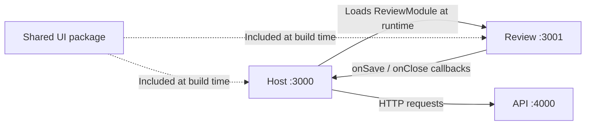

# ORDO

ORDO is a local purchase-document workspace. Import invoices and receipts, check extracted information against the original, and save reviewed documents. PDF text extraction and image OCR run in the Node.js API; no external AI service is required.

## Purpose and scope

ORDO is a personal project exploring React microfrontends with Webpack Module Federation through a concrete document-review workflow. It prioritizes frontend architecture and user experience, with deliberately limited product and infrastructure complexity. The three applications run on Azure Container Apps, each with its own GitHub Actions pipeline; see [Azure deployment](#azure-deployment).

## Run locally

Use Node.js **22.22+ in the 22.x line** or **24.19+ in the 24.x line**, and **pnpm 11.19.0**.

```sh
npm install --global pnpm@11.19.0
pnpm install --frozen-lockfile
pnpm dev
```

| Application | Address                          | Purpose                                   |
| ----------- | -------------------------------- | ----------------------------------------- |
| Host        | http://localhost:3000            | Complete document workflow                |
| Review      | http://localhost:3001            | Standalone microfrontend, initially empty |
| API         | http://localhost:4000/api/health | Backend availability                      |

The development servers bind to loopback. Both `localhost` and `127.0.0.1` work. The host proxies `/api` to port 4000. Use the host to review imported documents; the standalone Review page does not create its own API or router providers.

## Document workflow

1. Select or drop up to **five PDF, PNG, or JPEG files**, **10 MB each**. Originals are saved before extraction, and identical file contents are detected as duplicates.
2. Search by filename and filter by **All documents**, **Needs review**, or **Reviewed**. Status filters are stored in the URL and survive refresh.
3. Open a card to compare the original with editable supplier, reference, date, currency, subtotal, tax, and total fields. Suggested values always require review.
4. **Save and return** validates the document and returns to Reviewed with a confirmation. **Open review** in the summary starts a queue: **Save and next** opens the next unreviewed document, while **Save and finish** returns to the list. A confirmation identifies the saved and next filenames.

Originals and saved corrections survive reloads and API restarts. Failed saves keep the current draft, and documents that cannot be read automatically remain available for manual entry.

## Design decisions

- **A microfrontend for a small app:** separating Review provides a practical way to explore runtime composition and a boundary checked through typed props and integration tests. Separate builds and compatible releases add coordination that this application's size alone would not justify.
- **Local JSON storage:** one API process keeps setup simple, while the `DocumentStore` interface allows another persistence implementation later. This choice accepts the absence of shared storage and coordination across multiple API processes.
- **Parsing rules instead of an LLM:** PDF extraction, local OCR, and explicit rules keep processing inspectable and avoid external services. Coverage is narrower, so ambiguous or missing values require human input.
- **Shared types and runtime guards:** `packages/contracts` provides compile-time contracts and common validation rules for the host and API. It is not type-only: avoiding duplicated guards requires a JavaScript build consumed by both applications.
- **Scoped Tailwind utilities:** Review generates its utilities under `.ordo-review` to avoid changing host styles when loaded. This provides selector isolation, while both applications still need compatible shared theme tokens.

## Architecture

This is a pnpm monorepo. **Apps** have their own development server and production build. **Packages** provide shared contracts, validation, or UI components.

| Directory            | Responsibility                                                                                          |
| -------------------- | ------------------------------------------------------------------------------------------------------- |
| `apps/host`          | Application shell, React Router, TanStack Query, document collection, and review navigation             |
| `apps/review`        | Independent React microfrontend: original preview, React Hook Form draft, validation, and save feedback |
| `apps/api`           | Express endpoints, document processing, and persistence                                                 |
| `packages/contracts` | API contracts, runtime document guards, and microfrontend props, independent of React and Node.js       |
| `packages/ui`        | Reusable buttons, form fields, badges, filter chips, icons, layout, and theme                           |
| `config`             | Shared Webpack factory and HTML template                                                                |
| `tests`              | Shared setup and fictional fixtures; behavior tests live beside the code they exercise                  |

Dependencies such as `"@ordo/ui": "workspace:*"` resolve to local packages. UI code is included in each consuming application's build. `contracts` compiles to JavaScript and type declarations: type imports disappear, while the host and API use the same runtime document guards. Storage decoding and HTTP response decoding remain in their respective apps.

`pnpm dev` builds contracts first, then watches the package alongside the apps. Tests and type checks also prepare its build; tests resolve the package's source so watch mode sees changes immediately. Production builds follow workspace dependency order. Changing a shared package requires checking and rebuilding its consumers.

### Microfrontend and composite UI



The host loads `review/ReviewModule` from Review's `remoteEntry.js` with `React.lazy` and composes it with its shell and navigation. `ReviewModuleProps` in `packages/contracts/src/review.ts` defines the document data, original URL, and callbacks passed to Review; `onSave` returns the persisted document, while `onClose` delegates navigation to the host. `Suspense` handles loading and `RemoteBoundary` provides failure recovery. Module Federation shares React and React DOM as singletons through each app's asynchronous `index.ts` → `bootstrap.tsx` entry.

### State and responsibility boundaries

| Concern                                              | Owner                          |
| ---------------------------------------------------- | ------------------------------ |
| Routes, status filter, review queue                  | Host / React Router            |
| Server responses, mutations, cache                   | Host / TanStack Query          |
| Draft fields, validation errors, submission feedback | Review / React Hook Form       |
| File reading, field extraction, server validation    | API                            |
| Originals, saved fields, document revisions          | `DocumentStore` implementation |

Host pages compose feature components and hooks. `features/documents` handles the collection and imports; `features/document-review` handles document preparation, cache updates, and navigation after saving. Shared packages contain no application state.

The API's `createApp` selects the concrete store and document reader. Processing depends on their interfaces, so its coordination and revision rules can be tested independently of Express, PDF.js, and Tesseract. Parsing invoice fields is a pure function. Review's form conversion and validation are also separate from its components; the API independently validates every save.

### Shared UI and Tailwind

Components use Tailwind utilities. `packages/ui/src/theme.css` supplies theme tokens, base styles, Preflight, and bundled fonts. Only the host bootstrap or Review's standalone bootstrap imports that global theme.

Each app generates utilities from its own sources and the shared UI package.

`TextField` and `SelectField` associate labels, hints, and errors with native controls and accept React Hook Form registration. Buttons and link styles share the same visual variants without introducing a router dependency into the UI package.

## Typed requests and cache

The host provides one TanStack Query client above React Router. `ApiQueries` and `ApiMutations` in `apps/host/src/api/schema.ts` associate endpoint names with their inputs and responses; runtime decoders validate HTTP JSON before it enters the cache.

### Reading documents with `useTypedQuery`

Inside a component or feature hook, load a document by its `documentId: string`:

```tsx
const details = useTypedQuery(
  'document',
  { id: documentId },
  {
    select: (response) => response.document,
  },
);
// details.data: DocumentDetails | undefined
```

Endpoint names, required parameters, responses, and `select` results are inferred. `select` changes the value exposed to the component; the cache retains the full response.

### Saving through `useTypedMutation`

Create the mutation in a feature hook, then submit the displayed revision and corrected fields from the save handler:

```tsx
const review = useTypedMutation('reviewDocument');

// In the save handler:
const result = await review.mutateAsync({
  id: documentId,
  input: { revision, fields: correctedFields },
});
// result.document: DocumentDetails
```

After saving, feature hooks update the cached document and refresh the collection; the host decides whether to return to the list or continue the review queue.

Query data stays fresh for 30 seconds and inactive entries expire after five minutes; this memory cache is separate from persisted JSON. Stale queries refetch on mount, window focus, or reconnection; network and HTTP 5xx query failures retry once, while mutations do not retry automatically by default.

## API and persistence

| Method  | Endpoint                     | Purpose                                                |
| ------- | ---------------------------- | ------------------------------------------------------ |
| `GET`   | `/api/documents`             | Collection and upload limits                           |
| `POST`  | `/api/documents`             | Multipart import through the `files` field             |
| `GET`   | `/api/documents/:id`         | Metadata, fields, extraction outcome, and revision     |
| `GET`   | `/api/documents/:id/content` | Original file                                          |
| `POST`  | `/api/documents/:id/extract` | Prepare a pending import; completed results are reused |
| `PATCH` | `/api/documents/:id/review`  | Validate and save `{ revision, fields }`               |

`LocalDocumentStore` keeps each original and `document.json` under `apps/api/.data/documents/<sha256>/`. The SHA-256 ID detects identical uploads. Imports publish complete directories; updates replace metadata atomically and check the expected revision. Concurrent updates are serialized within one API process. A stale save returns `409` without overwriting newer fields.

Amounts are integer cents. Required fields, real calendar dates, supported currencies (EUR/USD/GBP), and matching subtotal + tax = total are checked by the API. These checks help review; they do not establish accounting or tax compliance.

Data and temporary files are ignored by Git. Test fixtures are fictional and are not loaded by the running application.

Original file URLs include their content hash and never change their bytes. Responses allow private browser caching for one year with `immutable`, so card previews and review pages can reuse the same file. This policy applies only to originals, not editable metadata. Revisit browser cache lifetime if access control or document removal is introduced.

### Reading documents

PDF.js first reads embedded PDF text. Pages with fewer than 40 non-whitespace characters are rendered for Tesseract OCR; mixed PDFs can use both paths. PNG/JPEG images use OCR directly. English and French models are installed with the project, and documents are never uploaded to an external recognition service.

| Processing limit                  | Value                                          |
| --------------------------------- | ---------------------------------------------- |
| PDF pages / scanned pages per PDF | 20 / 5                                         |
| Extracted text                    | 100,000 characters                             |
| Input image dimensions            | 32 megapixels                                  |
| Normalized OCR image              | At most 4 megapixels and 2,400 pixels per side |
| OCR concurrency                   | One worker; up to six active or waiting jobs   |
| Recognition deadline              | 30 seconds per image                           |

Imports wait for processing before returning. Simultaneous requests for the same pending document share one reader job. Each OCR worker is released after its job, including on timeout. Installed language models are copied lazily into one temporary directory per API process and reused across jobs; normal process shutdown removes that directory. A model preparation failure does not prevent later jobs from trying to initialize the models. Images and scanned PDFs share rendering limits. A review saved during extraction takes precedence over the extraction result.

Missing or ambiguous values stay empty; missing amounts are never derived from other fields. Limits and unreadable documents lead to manual review.

## Known limitations

- The parser targets simple printed invoices and receipts with English or French labels. Blurred photos, handwriting, and complex layouts are not reliably supported.
- The application supports one user and one API process, with no authentication or coordination between multiple API processes.
- Recorded OCR failures, including transient timeouts or a busy worker, are not retried when reopening or reimporting the document. Manual entry remains available.
- Unsaved edits are lost when leaving the review page; drafts are not persisted.
- Document deletion is not implemented.

## Checks and deployment

```sh
pnpm check          # Formatting, lint, types, tests, and production builds
pnpm test:watch     # Watch behavior tests
pnpm format        # Format sources
pnpm --filter @ordo/host... build
pnpm --filter @ordo/review... build
pnpm --filter @ordo/api... build
```

Strict TypeScript, ESLint, Prettier, Vitest, and React Testing Library cover the workspace. Tests exercise typed requests, real OCR and scanned PDFs, processing concurrency, persistence, stale revisions, form validation, and review navigation. Compile-time tests verify the typed query and mutation APIs. Review's component tests run without host providers; host integration tests use a local alias for the remote, so runtime federation also needs a browser check. Type checking runs separately from Webpack transpilation.

Each app builds into its own `dist` directory. Development and build commands do not deploy anything.

| Environment variable | Use                                                                                                     |
| -------------------- | ------------------------------------------------------------------------------------------------------- |
| `REVIEW_REMOTE_URL`  | Remote entry URL when building or starting the host; defaults to `http://127.0.0.1:3001/remoteEntry.js` |
| `HOST_URL`           | Return URL when building or starting standalone Review; defaults to `http://localhost:3000`             |
| `DATA_DIR`           | API document storage directory                                                                          |
| `PORT` / `HOST`      | API listening address; defaults to `4000` / `127.0.0.1`                                                 |

Set variables in the shell; `.env` files are not loaded automatically. Frontends expect the root of their respective origins. The host needs an SPA fallback for page routes, excluding assets and `/api`; remote assets must allow the host's origin through CORS.

## Azure deployment

| Application | Address                                                                    | Azure resource                           |
| ----------- | -------------------------------------------------------------------------- | ---------------------------------------- |
| Host        | https://ordo-host.bravemoss-c87c792b.francecentral.azurecontainerapps.io   | Container App, nginx, public ingress     |
| Review      | https://ordo-review.bravemoss-c87c792b.francecentral.azurecontainerapps.io | Container App, nginx, public ingress     |
| API         | Reached through the host `/api` proxy                                      | Container App, Node.js, internal ingress |

### Setup

- Resource group `ordo-rg` in France Central: a Container Apps environment (Consumption plan), a Basic container registry, a storage account with a `documents` file share, and a Log Analytics workspace.
- One `Dockerfile` per application, built from the repository root. The API image ships the compiled code, the Tesseract models, and the canvas binary; the file share is mounted at `/data`. Host and Review are production Webpack builds served by nginx, configured by the `nginx.conf.template` next to each app.
- The host receives `REVIEW_REMOTE_URL` at build time and proxies `/api` to the API over the environment's internal DNS. Review allows only the host origin through CORS and serves `remoteEntry.js` with `no-cache`, so a new Review release is loaded on the next host visit.
- GitHub Actions signs in with OpenID Connect; no Azure secret is stored in GitHub.

### CI/CD: one pipeline per application

| Workflow            | Runs when these paths change                         | Deploys       |
| ------------------- | ---------------------------------------------------- | ------------- |
| `deploy-api.yml`    | `apps/api`, `packages/contracts`, workspace files    | `ordo-api`    |
| `deploy-host.yml`   | `apps/host`, `packages`, `config`, workspace files   | `ordo-host`   |
| `deploy-review.yml` | `apps/review`, `packages`, `config`, workspace files | `ordo-review` |

`ci.yml` runs `pnpm check` on every pull request and push to `main`. Each deployment workflow first waits for that CI run on the same commit and stops unless it succeeded; it then builds the image, pushes it tagged with the commit SHA, and updates its Container App, which creates a new revision.

Advantages:

- A change under `apps/review` ships Review only; the host loads the new remote at runtime without being redeployed.
- A change under `apps/api` never rebuilds a frontend, and a frontend change never restarts the API.
- Shared packages are compiled into their consumers, so a change there runs every affected pipeline.
- The pipelines resolve the host and Review addresses from the Container Apps environment at build time.
