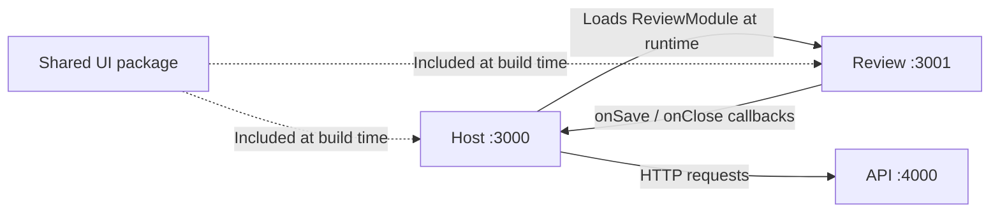

# ORDO

ORDO is a local purchase-document workspace. Import invoices and receipts, check extracted information against the original, and save reviewed documents. PDF text extraction and image OCR run in the Node.js API; no external AI service is required.

## Run locally

Use Node.js **22.22+ in the 22.x line** or **24.19+ in the 24.x line**, and **pnpm 11.19.0**.

```sh
npm install --global pnpm@11.19.0
pnpm install --frozen-lockfile
pnpm dev
```

| Application | Address                          | Purpose                                   |
| ----------- | -------------------------------- | ----------------------------------------- |
| Host        | http://localhost:3000            | Complete document workflow                |
| Review      | http://localhost:3001            | Standalone microfrontend, initially empty |
| API         | http://localhost:4000/api/health | Backend availability                      |

The development servers bind to loopback. Both `localhost` and `127.0.0.1` work. The host proxies `/api` to port 4000. Use the host to review imported documents; the standalone Review page does not create its own API or router providers.

## Document workflow

1. Select or drop up to **five PDF, PNG, or JPEG files**, **10 MB each**. Originals are saved before extraction, and identical file contents are detected as duplicates.
2. Search by filename and filter by **All documents**, **Needs review**, or **Reviewed**. Status filters are stored in the URL and survive refresh.
3. Open a card to compare the original with editable supplier, reference, date, currency, subtotal, tax, and total fields. Suggested values always require review.
4. **Save and return** validates the document and returns to Reviewed with a confirmation. **Open review** in the summary starts a queue: **Save and next** opens the next unreviewed document, while **Save and finish** returns to the list. A confirmation identifies the saved and next filenames.

Originals and saved corrections survive reloads and API restarts. Failed saves keep the current draft. Unsaved edits are discarded when leaving the review page. Documents that cannot be read automatically remain available for manual entry.

## Architecture

This is a pnpm monorepo. **Apps** have their own development server and production build. **Packages** provide shared contracts, validation, or UI components.

| Directory            | Responsibility                                                                                          |
| -------------------- | ------------------------------------------------------------------------------------------------------- |
| `apps/host`          | Application shell, React Router, TanStack Query, document collection, and review navigation             |
| `apps/review`        | Independent React microfrontend: original preview, React Hook Form draft, validation, and save feedback |
| `apps/api`           | Express endpoints, document processing, and persistence                                                 |
| `packages/contracts` | API contracts, runtime document guards, and microfrontend props, independent of React and Node.js       |
| `packages/ui`        | Reusable buttons, form fields, badges, filter chips, icons, layout, and theme                           |
| `config`             | Shared Webpack factory and HTML template                                                                |
| `tests`              | Shared setup and fictional fixtures; behavior tests live beside the code they exercise                  |

Dependencies such as `"@ordo/ui": "workspace:*"` resolve to local packages. UI code is included in each consuming application's build. `contracts` compiles to JavaScript and type declarations: type imports disappear, while the host and API use the same runtime document guards. Storage decoding and HTTP response decoding remain in their respective apps.

`pnpm dev` builds contracts first, then watches the package alongside the apps. Tests and type checks also prepare its build; tests resolve the package's source so watch mode sees changes immediately. Production builds follow workspace dependency order. Changing a shared package requires checking and rebuilding its consumers.

### Microfrontend and composite UI



Webpack Module Federation loads Review at runtime:

1. `apps/review/webpack.config.cjs` exposes `ReviewModule` through `remoteEntry.js`.
2. The host maps `review` to the remote URL and loads `review/ReviewModule` with `React.lazy`.
3. The host passes document data, the original file URL, and typed save/close callbacks. `Suspense` covers loading; `RemoteBoundary` provides recovery if the remote fails.

The host composes its collection and navigation with the independently built Review interface. This is the composite UI; `packages/ui` supplies the shared visual building blocks. React and React DOM are shared singletons, initialized through each application's asynchronous `index.ts` → `bootstrap.tsx` entry.

`DocumentReviewProps` and `ReviewModuleProps` in `packages/contracts/src/review.ts` define the integration. Review owns no router, query client, or API transport. Its `onSave` callback resolves with the persisted document or rejects with an error. Optional save labels explain the host's next action without exposing routing logic to the microfrontend. Public types check compatibility at compile time; compatible deployments are still required at runtime.

### State and responsibility boundaries

| Concern                                              | Owner                          |
| ---------------------------------------------------- | ------------------------------ |
| Routes, status filter, review queue                  | Host / React Router            |
| Server responses, mutations, cache                   | Host / TanStack Query          |
| Draft fields, validation errors, submission feedback | Review / React Hook Form       |
| File reading, field extraction, server validation    | API                            |
| Originals, saved fields, document revisions          | `DocumentStore` implementation |

Host pages compose feature components and hooks. `features/documents` handles the collection and imports; `features/document-review` handles document preparation, cache updates, and navigation after saving. Shared packages contain no application state.

The API's `createApp` selects the concrete store and document reader. Processing depends on their interfaces, so its coordination and revision rules can be tested independently of Express, PDF.js, and Tesseract. Parsing invoice fields is a pure function. Review's form conversion and validation are also separate from its components; the API independently validates every save.

### Shared UI and Tailwind

Components use Tailwind utilities. `packages/ui/src/theme.css` supplies theme tokens, base styles, Preflight, and bundled fonts. Only the host bootstrap or Review's standalone bootstrap imports that global theme.

Each app generates utilities from its own sources and the shared UI package. The exposed Review module scopes its utilities under `.ordo-review`, preventing its generated selectors from restyling the host. This is CSS selector scoping; both applications still depend on compatible theme tokens.

`TextField` and `SelectField` associate labels, hints, and errors with native controls and accept React Hook Form registration. Buttons and link styles share the same visual variants without introducing a router dependency into the UI package.

## Typed requests and cache

The host creates one TanStack Query client above React Router, preserving its cache across navigation. `ApiQueries` and `ApiMutations` live together in `apps/host/src/api/schema.ts`: they describe the frontend's endpoint names, parameters, variables, and responses using shared contract types. The host's endpoint catalog supplies URL builders and runtime decoders: HTTP JSON enters as `unknown` and is checked before reaching the cache.

### Reading documents with `useTypedQuery`

Inside a component or feature hook, load the collection without parameters:

```tsx
const collection = useTypedQuery('documents');
// collection.data: DocumentsResponse | undefined
// collection.data?.documents: UploadedDocument[] | undefined
```

For a selected `documentId: string`, request its details and select the document from the response:

```tsx
const details = useTypedQuery(
  'document',
  { id: documentId },
  {
    select: (response) => response.document,
  },
);
// details.data: DocumentDetails | undefined
// details.data?.fields.totalCents: number | null | undefined
```

Endpoint names, required parameters, responses, and `select` results are inferred. An unknown endpoint, a missing document ID, or a numeric ID causes a TypeScript error. The hook retains TanStack Query options such as `enabled` and `staleTime` while owning the cache key, request function, and response decoding. `select` transforms the observer's result; the cache keeps the full endpoint response.

`getTypedQueryOptions` provides the same typed keys and requests outside hooks:

```ts
await queryClient.prefetchQuery(getTypedQueryOptions('document', { id: documentId }));

await queryClient.invalidateQueries({
  queryKey: getTypedQueryOptions('documents').queryKey,
});
```

Keys follow `['api', endpoint, params]`. Data is fresh for 30 seconds; inactive entries expire after five minutes. Stale queries refetch on mount, window focus, or reconnection. Network and HTTP 5xx failures retry once; HTTP 4xx and invalid payloads do not. Cancellation reaches `fetch` through `AbortSignal`. This memory cache is separate from the API's persistent storage.

### Saving through `useTypedMutation`

The mutation catalog associates `uploadDocuments`, `extractDocument`, and `reviewDocument` with typed variables and decoded responses. For example, within a feature hook:

```tsx
const review = useTypedMutation('reviewDocument');

// In the save handler, using the displayed revision and corrected DocumentFields:
const result = await review.mutateAsync({
  id: documentId,
  input: { revision, fields: correctedFields },
});
// result.document: DocumentDetails
```

Mutations do not retry automatically by default. Feature hooks supply cache updates: `useDocumentReview` publishes returned details without replacing a newer revision, updates the collection's status, and invalidates its query. `useReviewFlow` decides whether to return to the list or continue the queue. A failed queue refresh does not report a successful save as a failure.

`useDocumentUpload` sends multipart files and refreshes the collection after both success and failure, since a storage failure can occur after earlier files were saved. Successful imports clear filters so the new documents are visible.

## API and persistence

| Method  | Endpoint                     | Purpose                                                |
| ------- | ---------------------------- | ------------------------------------------------------ |
| `GET`   | `/api/documents`             | Collection and upload limits                           |
| `POST`  | `/api/documents`             | Multipart import through the `files` field             |
| `GET`   | `/api/documents/:id`         | Metadata, fields, extraction outcome, and revision     |
| `GET`   | `/api/documents/:id/content` | Original file                                          |
| `POST`  | `/api/documents/:id/extract` | Prepare a pending import; completed results are reused |
| `PATCH` | `/api/documents/:id/review`  | Validate and save `{ revision, fields }`               |

`LocalDocumentStore` keeps each original and `document.json` under `apps/api/.data/documents/<sha256>/`. The SHA-256 ID detects identical uploads. Imports publish complete directories; updates replace metadata atomically and check the expected revision. Concurrent updates are serialized within one API process. A stale save returns `409` without overwriting newer fields.

Amounts are integer cents. Required fields, real calendar dates, supported currencies (EUR/USD/GBP), and matching subtotal + tax = total are checked by the API. These checks help review; they do not establish accounting or tax compliance.

The store supports one local workspace and one API process. Data and temporary files are ignored by Git. Test fixtures are fictional and are not loaded by the running application.

Original file URLs include their content hash and never change their bytes. Responses allow private browser caching for one year with `immutable`, so card previews and review pages can reuse the same file. This policy applies only to originals, not editable metadata. Revisit browser cache lifetime if access control or document removal is introduced.

### Reading documents

PDF.js first reads embedded PDF text. Pages with fewer than 40 non-whitespace characters are rendered for Tesseract OCR; mixed PDFs can use both paths. PNG/JPEG images use OCR directly. English and French models are installed with the project, and documents are never uploaded to an external recognition service.

| Processing limit                  | Value                                          |
| --------------------------------- | ---------------------------------------------- |
| PDF pages / scanned pages per PDF | 20 / 5                                         |
| Extracted text                    | 100,000 characters                             |
| Input image dimensions            | 32 megapixels                                  |
| Normalized OCR image              | At most 4 megapixels and 2,400 pixels per side |
| OCR concurrency                   | One worker; up to six active or waiting jobs   |
| Recognition deadline              | 30 seconds per image                           |

Imports wait for processing before returning. Simultaneous requests for the same pending document share one reader job. Each OCR worker is released after its job, including on timeout. Installed language models are copied lazily into one temporary directory per API process and reused across jobs; normal process shutdown removes that directory. Failed preparation can be retried. Images and scanned PDFs share rendering limits. A review saved during extraction takes precedence over the extraction result.

The parser supports simple printed invoices and receipts with English or French labels. Missing or ambiguous values stay empty; missing amounts are never derived from other fields. Limits and unreadable documents lead to manual review. Blurred photos, handwriting, and complex layouts may require corrections.

## Checks and deployment

```sh
pnpm check          # Formatting, lint, types, tests, and production builds
pnpm test:watch     # Watch behavior tests
pnpm format        # Format sources
pnpm --filter @ordo/host... build
pnpm --filter @ordo/review... build
pnpm --filter @ordo/api... build
```

Strict TypeScript, ESLint, Prettier, Vitest, and React Testing Library cover the workspace. Tests exercise typed requests, real OCR and scanned PDFs, processing concurrency, persistence, stale revisions, form validation, and review navigation. Compile-time tests verify the typed query and mutation APIs. Review's component tests run without host providers; host integration tests use a local alias for the remote, so runtime federation also needs a browser check. Type checking runs separately from Webpack transpilation.

Azure hosting and CI/CD are not configured yet. Each app builds into its own `dist` directory. Future deployment needs durable storage behind `DocumentStore`, the installed OCR models and native canvas runtime, API routing, and compatible host/remote releases.

| Environment variable | Use                                                                                                     |
| -------------------- | ------------------------------------------------------------------------------------------------------- |
| `REVIEW_REMOTE_URL`  | Remote entry URL when building or starting the host; defaults to `http://127.0.0.1:3001/remoteEntry.js` |
| `HOST_URL`           | Return URL when building or starting standalone Review; defaults to `http://localhost:3000`             |
| `DATA_DIR`           | API document storage directory                                                                          |
| `PORT` / `HOST`      | API listening address; defaults to `4000` / `127.0.0.1`                                                 |

Set variables in the shell; `.env` files are not loaded automatically. Frontends expect the root of their respective origins. The host needs an SPA fallback for page routes, excluding assets and `/api`; remote assets must allow the host's origin through CORS. Development and build commands do not deploy anything.
