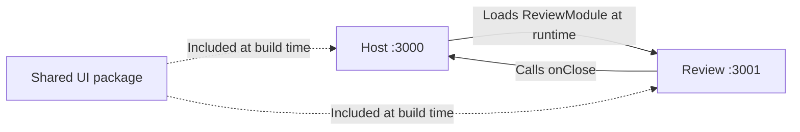

# ORDO

ORDO helps independent professionals collect purchase documents, review extracted information, and prepare an expense summary.

## Status

The local foundation includes a federated review module, URL navigation, and a cached API health request. Screens currently show empty states and service availability. Uploads, extraction, editing, and export are not implemented yet.

## First release

The first release will support a batch of up to five documents:

1. Upload purchase invoices as text-based PDFs or PNG/JPEG images.
2. Follow the processing status of each document independently.
3. Review the original document beside an editable form.
4. Correct extracted supplier names, invoice references, dates, currencies, and totals.
5. Confirm reviewed documents and export their data as CSV.

Processing failures will remain isolated per document. File hashes will identify exact duplicate uploads.

## Document processing

The planned backend uses PDF.js for embedded PDF text, Tesseract.js for image OCR, and TypeScript rules for field extraction and arithmetic checks. No LLM service is required.

Extracted values require human review; missing values remain empty. Arithmetic checks are review aids, not accounting or tax guarantees.

The first release targets selected invoice layouts. Scanned PDFs, arbitrary receipt layouts, and detailed line items are later extensions.

## Architecture

This repository is a pnpm monorepo. **Applications** run independently; **packages** provide reusable code consumed by those applications.

| Directory            | Responsibility                                                                                 |
| -------------------- | ---------------------------------------------------------------------------------------------- |
| `apps/host`          | React application shell, navigation, and the document collection workflow.                     |
| `apps/review`        | Review microfrontend with its own development server and build; exposes `review/ReviewModule`. |
| `apps/api`           | Express application and HTTP server; currently provides `GET /api/health`.                     |
| `packages/contracts` | Framework-independent types for review props, API query parameters, and responses.             |
| `packages/ui`        | Shared React components, button variants, styles, and locally bundled fonts.                   |
| `config`             | Common Webpack configuration and HTML template used by both frontends.                         |
| `tests`              | Shared test setup; behavior tests live beside the code they exercise.                          |

Each workspace has its own `package.json`. pnpm links `"@ordo/ui": "workspace:*"` to the local package, which is included at build time. Shared package changes require rebuilding their consumers. Dependencies, build output, and local caches are excluded from Git.

`@ordo/ui` exports `Button` with primary and secondary variants, native button props, and `type="button"` by default. Navigation links use the same appearance through `buttonClassName`, keeping the UI package independent of React Router.

### How the microfrontend loads



1. Review's Webpack `exposes` publishes `ReviewModule.tsx` through a generated `remoteEntry.js`.
2. The host's `remotes` maps `review` to that URL. `React.lazy(() => import('review/ReviewModule'))` loads the component asynchronously.
3. The host renders it with typed props; `onClose` returns to the document workspace.

`Suspense` handles loading; an error boundary handles remote failures. React and React DOM are shared singletons, initialized through the asynchronous `index.ts` → `bootstrap.tsx` entry. `remotes.d.ts` supplies compile-time types, not runtime validation.

Review also has a standalone development page. The host uses the exposed component without running that page's `createRoot()`.

### Boundaries and configuration

The host owns navigation, Review owns its interface, and the API owns processing. Applications communicate through public contracts. Shared packages contain no application state. Future business rules will remain independent of React, HTTP, and extraction libraries.

The common Webpack factory handles TypeScript, CSS, fonts, and federation. Each frontend supplies its name, port, and exposed or consumed modules. Query dependencies form a separate chunk. Frontends have separate builds and can be deployed independently while their contracts and shared dependencies remain compatible.

Root scripts coordinate checks: strict TypeScript settings come from `tsconfig.base.json`, with ESLint, Prettier, and Vitest for code quality, formatting, and behavior tests. Type checking runs separately from Webpack transpilation.

Across all applications and shared packages, custom React hooks live in a `hooks` directory. Each hook's filename matches its export, such as `useTypedQuery.ts`, with tests alongside it. Conditional JSX rendering uses explicit ternaries (`condition ? content : null`); ESLint flags short-circuit rendering with `&&`.

### Navigation

One React Router `BrowserRouter` runs in the host. `/` redirects to `/documents`; `/review` loads Review. Unknown URLs show a recovery page. Direct links, refresh, and browser history are supported. `App.tsx` declares routes; page components compose screens.

Review stays router-independent through `onClose`. Vitest navigation tests use the actual review component through a local alias; browser checks verify network-based federation.

### API requests and cache

One TanStack Query client is created above the router in `bootstrap.tsx`, preserving cache across navigation. The real `GET /api/health` request demonstrates loading, availability, connection, and retry states.

| Host source directory     | Responsibility                                                                  |
| ------------------------- | ------------------------------------------------------------------------------- |
| `app`                     | Application-level setup, including query defaults.                              |
| `pages`                   | Route-level screen composition.                                                 |
| `api`                     | Typed endpoint catalog, query options, JSON transport, and response validation. |
| `hooks`                   | Shared React hooks, named after their exports, such as `useTypedQuery.ts`.      |
| `features/service-health` | Service status UI and its behavior tests.                                       |

Components call `useTypedQuery` with a registered GET endpoint. `ApiQueries` in `@ordo/contracts` associates each endpoint with its parameters and response; the host catalog supplies its URL builder and runtime decoder. Responses enter as `unknown` and are validated before success. Query cancellation reaches `fetch` through `AbortSignal`.

```tsx
const health = useTypedQuery('serviceHealth');
// health.data: ServiceHealthResponse | undefined

const status = useTypedQuery('serviceHealth', undefined, {
  select: (response) => response.status,
  staleTime: 60_000,
});
// status.data: 'ok' | undefined
```

Endpoint parameters are inferred and required when declared. The hook retains options such as `enabled`, `select`, and `staleTime`; it owns the query function and cache key. Initial cache data and custom key hashing are excluded. `getTypedQueryOptions` supplies the same typed key and request for prefetching or invalidation. Compile-time tests reject unknown endpoints, incorrect parameters, and incompatible responses.

Data stays fresh for 30 seconds; inactive cache entries expire after 5 minutes. Stale queries refetch on mount, focus, or reconnection. Network and HTTP 5xx failures retry once; HTTP 4xx and invalid responses do not. Cache is memory-only, with no polling.

Keys follow `['api', endpoint, params]`, separating endpoint and parameter combinations. Only `serviceHealth` is registered today; new APIs require a contract, URL builder, and decoder. Future mutations will invalidate affected keys. TanStack Query owns server state; React owns transient UI state. Review currently makes no API requests and does not consume the host's query client.

## Stack

- React and TypeScript with strict checking
- Webpack 5 and Module Federation
- React Router for URL-based navigation
- TanStack Query for server state, requests, and caching
- Tailwind CSS 4 through PostCSS; current screens primarily use custom shared CSS
- Vitest and React Testing Library for user-facing behavior
- ESLint and Prettier
- Node.js and Express
- pnpm workspaces with a committed lockfile

Redux Toolkit, React Hook Form, PDF.js, and Tesseract.js will accompany the features that need them. Azure Pipelines and Azure hosting are planned; backend hosting depends on OCR runtime requirements. Deployment is not configured yet.

## Development

Use Node.js 22.22 or later in the 22.x line, or Node.js 24.19 or later in the 24.x line, and pnpm 11.19.0. npm can install the package manager:

```sh
npm install --global pnpm@11.19.0
pnpm install --frozen-lockfile
pnpm dev
```

| Application       | Local address                    |
| ----------------- | -------------------------------- |
| Workspace host    | http://127.0.0.1:3000            |
| Standalone review | http://127.0.0.1:3001            |
| API health        | http://127.0.0.1:4000/api/health |

Select **Open review workspace** in the host to load Review. The host proxies `/api` to the backend. Development servers bind to loopback by default.

```sh
pnpm check          # Formatting, lint, types, tests, and production builds
pnpm test:watch     # Watch behavior tests
pnpm format        # Apply formatting
pnpm --filter @ordo/host build
pnpm --filter @ordo/review build
pnpm --filter @ordo/api build
```

Build output lives in each application's `dist` directory. `REVIEW_REMOTE_URL` overrides the remote entry URL when building or starting the host; the default is `http://127.0.0.1:3001/remoteEntry.js`. The API accepts `PORT` and `HOST`. Environment variables must be set in the shell; `.env` files are not loaded automatically.

Frontends currently expect hosting at the root of their respective origins. Future hosting must serve their assets, allow the host origin through CORS on review assets, route API requests, and provide the deployed review URL. The host needs an SPA fallback for page URLs, excluding assets and `/api`. Nothing is deployed by the development or build commands.
