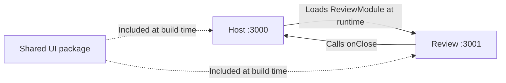

# ORDO

ORDO helps independent professionals collect purchase documents, review extracted information, and prepare an expense summary.

## Status

The application foundation is ready for local development: a React host loads a separate review application through Webpack Module Federation, and a Node.js API exposes a health endpoint. The screens currently contain empty states. Uploads, extraction, editing, and export are not implemented yet.

## First release

The first release will support a batch of up to five documents:

1. Upload purchase invoices as text-based PDFs or PNG/JPEG images.
2. Follow the processing status of each document independently.
3. Review the original document beside an editable form.
4. Correct extracted supplier names, invoice references, dates, currencies, and totals.
5. Confirm reviewed documents and export their data as CSV.

Processing errors remain specific to the affected document. Other documents can still be reviewed. Exact duplicate uploads are identified using file hashes.

## Document processing

The planned Node.js backend extracts embedded text from digital PDFs with PDF.js and recognizes text in images with Tesseract.js. TypeScript rules identify candidate fields and check arithmetic consistency.

Extraction may be incomplete or ambiguous. Missing values remain empty, and proposed values require review. Arithmetic checks provide review aids rather than a guarantee of accounting or tax compliance.

The first release targets a documented set of invoice layouts. Scanned PDFs, arbitrary receipt layouts, and detailed line-item extraction are later extensions. No LLM service is required.

## Architecture

This repository is a pnpm monorepo. **Applications** run independently; **packages** provide reusable code consumed by those applications.

| Directory            | Responsibility                                                                                 |
| -------------------- | ---------------------------------------------------------------------------------------------- |
| `apps/host`          | React application shell, navigation, and the document collection workflow.                     |
| `apps/review`        | Review microfrontend with its own development server and build; exposes `review/ReviewModule`. |
| `apps/api`           | Express application and HTTP server; currently provides `GET /api/health`.                     |
| `packages/contracts` | Framework-independent TypeScript contracts, including the review module's props.               |
| `packages/ui`        | Shared branding, styles, and locally bundled fonts.                                            |
| `config`             | Common Webpack configuration and HTML template used by both frontends.                         |
| `tests`              | Shared test setup; behavior tests live beside the code they exercise.                          |

Each workspace has its own `package.json`. Dependencies such as `"@ordo/ui": "workspace:*"` resolve to local packages through pnpm. Those packages are included in the consuming application's build; changing them requires rebuilding the affected applications. Generated `dist`, dependencies, caches, and temporary files are excluded from Git.

### How the microfrontend loads



1. The review application's Webpack `exposes` configuration makes `ReviewModule.tsx` available through a generated `remoteEntry.js`.
2. The host's `remotes` configuration maps the name `review` to that remote entry URL. `React.lazy(() => import('review/ReviewModule'))` loads the component asynchronously.
3. The host renders the component in its React tree and passes typed props. The `onClose` callback currently returns to the document workspace.

`Suspense` handles loading, while an error boundary preserves host navigation if the remote fails to load or render. React and React DOM are shared as singletons. The asynchronous `index.ts` → `bootstrap.tsx` entry lets Webpack initialize shared dependencies before React starts. `remotes.d.ts` describes the exposed component to TypeScript; it does not load or validate remote code at runtime.

The standalone review page is a development entry point. The host imports the exposed component directly, without running that page's `createRoot()`.

### Boundaries and configuration

The host owns navigation, the review module owns its review interface, and the API owns document processing. Cross-application communication uses public contracts rather than imports of another application's internal files. The shared packages contain no application state. Business rules will stay independent of React, HTTP handlers, and extraction libraries as those features are added.

The common Webpack factory handles TypeScript, CSS, fonts, and shared dependencies. Each frontend's configuration supplies its name, port, and federation settings. Each frontend produces a separate build, allowing independent deployment while its public contract and shared dependency versions remain compatible. Deployment is not configured yet.

Root scripts coordinate the workspace checks. `tsconfig.base.json` supplies strict TypeScript settings, ESLint checks code quality, Prettier handles formatting, and Vitest runs behavior tests. Type checking runs separately from Webpack transpilation.

### Navigation

The host owns a single React Router `BrowserRouter`. `/` redirects to `/documents`, `/review` loads the review microfrontend, and unmatched URLs display a recovery page. URLs support direct entry, refresh, and browser history. Page components handle their own composition; `App.tsx` declares the routes and shared shell.

The exposed review component does not depend on the host's router. Its typed `onClose` callback lets the host decide where to navigate, while the standalone review entry remains independently usable. Navigation tests resolve the remote to its source component through a Vitest-only alias; actual network loading is checked in the local browser.

## Stack

- React and TypeScript with strict checking
- Webpack 5 and Module Federation
- React Router for URL-based navigation
- Tailwind CSS
- Vitest and React Testing Library for user-facing behavior
- ESLint and Prettier
- Node.js and Express
- pnpm workspaces with a committed lockfile

Redux Toolkit, React Hook Form, PDF.js, and Tesseract.js will be added with the features that need them. Azure Pipelines and Azure hosting are planned. The backend hosting service will be selected after verifying the OCR runtime requirements. Deployment is not configured yet.

## Development

Use Node.js 22.22 or later in the 22.x line, or Node.js 24.19 or later in the 24.x line, and pnpm 11.19.0. npm can install the package manager:

```sh
npm install --global pnpm@11.19.0
pnpm install --frozen-lockfile
pnpm dev
```

| Application       | Local address                    |
| ----------------- | -------------------------------- |
| Workspace host    | http://127.0.0.1:3000            |
| Standalone review | http://127.0.0.1:3001            |
| API health        | http://127.0.0.1:4000/api/health |

Open the host and select **Open review workspace** to load the remote application. The standalone review address is a local development entry point. The host development server proxies `/api` requests to the API. All three servers bind to the loopback interface by default.

```sh
pnpm check          # Formatting, lint, types, tests, and production builds
pnpm test:watch     # Watch behavior tests
pnpm format        # Apply formatting
pnpm --filter @ordo/host build
pnpm --filter @ordo/review build
pnpm --filter @ordo/api build
```

Build output lives in each application's `dist` directory. `REVIEW_REMOTE_URL` overrides the remote entry URL when building or starting the host; the default is `http://127.0.0.1:3001/remoteEntry.js`. The API accepts `PORT` and `HOST`. Environment variables must be set in the shell; `.env` files are not loaded automatically.

Future hosting configuration must serve each frontend's assets, allow the host origin through CORS on review assets, route API requests, and provide the deployed review URL. The host also needs an SPA fallback for page URLs such as `/review`, excluding assets and `/api` requests. Nothing is deployed by the development or build commands.
